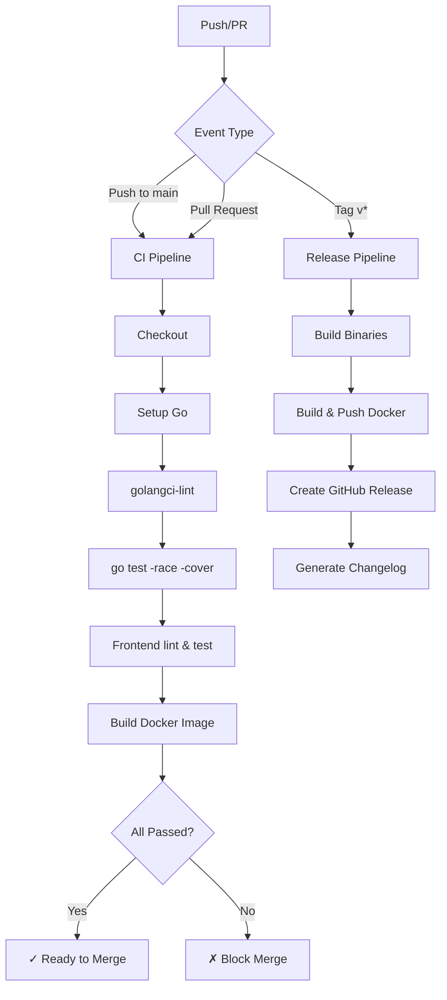

# Design Document: Open Source Excellence

## Overview

本设计文档描述如何将 ChatRoom 项目从教学 Demo 提升为符合开源社区标准的优秀项目。设计涵盖项目结构优化、文档体系建设、CI/CD 流水线配置、测试策略、容器化部署方案等方面。

项目当前状态：
- 后端：Go 1.24 + Gin + GORM + WebSocket
- 前端：React 19 + TypeScript + Vite
- 数据库：PostgreSQL 16 (Docker)
- 已有基础文档：README.md、DESIGN.md、PROJECT_ROADMAP.md、AGENTS.md

## Architecture

### 项目目录结构（目标状态）

```
chatroom/
├── .github/
│   ├── workflows/
│   │   ├── ci.yml              # 主 CI 流水线
│   │   ├── release.yml         # 发布流水线
│   │   └── security.yml        # 安全扫描
│   ├── ISSUE_TEMPLATE/
│   │   ├── bug_report.md
│   │   └── feature_request.md
│   ├── PULL_REQUEST_TEMPLATE.md
│   └── dependabot.yml
├── cmd/server/
├── internal/
├── frontend/
├── web/
├── docs/
│   ├── DESIGN.md
│   ├── API.md                  # 新增：API 文档
│   ├── ARCHITECTURE.md         # 新增：架构文档
│   └── monitoring/
│       └── grafana-dashboard.json
├── deploy/
│   ├── docker/
│   │   └── Dockerfile
│   └── k8s/
│       ├── deployment.yaml
│       ├── service.yaml
│       └── configmap.yaml
├── scripts/
├── .editorconfig               # 新增
├── .env.example                # 新增
├── .golangci.yml               # 新增
├── CHANGELOG.md                # 新增
├── CODE_OF_CONDUCT.md          # 新增
├── CONTRIBUTING.md             # 新增
├── LICENSE                     # 新增
├── SECURITY.md                 # 新增
├── Makefile                    # 新增
├── docker-compose.yml
├── go.mod
└── README.md
```

### CI/CD 流水线架构



## Components and Interfaces

### 1. 开源标准文件组件

| 文件 | 用途 | 模板来源 |
|------|------|----------|
| LICENSE | MIT 开源许可证 | SPDX 标准 |
| CONTRIBUTING.md | 贡献指南 | GitHub 社区标准 |
| CODE_OF_CONDUCT.md | 行为准则 | Contributor Covenant |
| SECURITY.md | 安全漏洞报告 | GitHub 安全策略 |
| CHANGELOG.md | 版本变更记录 | Keep a Changelog |

### 2. CI/CD 组件

**GitHub Actions Workflows:**

```yaml
# .github/workflows/ci.yml 核心结构
name: CI
on: [push, pull_request]
jobs:
  lint:
    runs-on: ubuntu-latest
    steps:
      - uses: golangci/golangci-lint-action@v4
  
  test:
    runs-on: ubuntu-latest
    services:
      postgres: ...
    steps:
      - run: go test -race -coverprofile=coverage.out ./...
      - uses: codecov/codecov-action@v4
  
  frontend:
    runs-on: ubuntu-latest
    steps:
      - run: npm ci && npm run lint && npm run build
  
  docker:
    needs: [lint, test, frontend]
    steps:
      - uses: docker/build-push-action@v5
```

### 3. 代码质量组件

**golangci-lint 配置 (.golangci.yml):**

```yaml
linters:
  enable:
    - errcheck      # 检查未处理的错误
    - gosimple      # 简化代码建议
    - govet         # Go vet 检查
    - ineffassign   # 无效赋值检测
    - staticcheck   # 静态分析
    - unused        # 未使用代码检测
    - gofmt         # 格式化检查
    - goimports     # import 排序
    - misspell      # 拼写检查
    - gosec         # 安全检查

linters-settings:
  errcheck:
    check-type-assertions: true
  govet:
    check-shadowing: true

issues:
  exclude-rules:
    - path: _test\.go
      linters:
        - errcheck
```

### 4. 容器化组件

**多阶段 Dockerfile:**

```dockerfile
# 构建阶段
FROM golang:1.24-alpine AS builder
WORKDIR /app
COPY go.mod go.sum ./
RUN go mod download
COPY . .
RUN CGO_ENABLED=0 GOOS=linux go build -ldflags="-s -w" -o /chatroom ./cmd/server

# 运行阶段
FROM alpine:3.19
RUN apk --no-cache add ca-certificates tzdata
COPY --from=builder /chatroom /chatroom
COPY --from=builder /app/web /web
EXPOSE 8080
ENTRYPOINT ["/chatroom"]
```

### 5. 健康检查接口

```go
// 新增健康检查端点
// GET /health - 存活检查
// GET /ready  - 就绪检查（含数据库连接）

type HealthResponse struct {
    Status    string `json:"status"`
    Timestamp string `json:"timestamp"`
}

type ReadyResponse struct {
    Status   string            `json:"status"`
    Checks   map[string]string `json:"checks"`
}
```

## Data Models

### 版本信息模型

```go
// 构建时注入的版本信息
var (
    Version   = "dev"
    GitCommit = "unknown"
    BuildTime = "unknown"
)

type VersionInfo struct {
    Version   string `json:"version"`
    GitCommit string `json:"git_commit"`
    BuildTime string `json:"build_time"`
    GoVersion string `json:"go_version"`
}
```

### 配置模型扩展

```go
// 扩展现有配置，增加健康检查和可观测性配置
type Config struct {
    // 现有配置...
    
    // 新增配置
    HealthCheckPath string // 健康检查路径，默认 /health
    ReadyCheckPath  string // 就绪检查路径，默认 /ready
    LogLevel        string // 日志级别：debug, info, warn, error
    LogFormat       string // 日志格式：json, console
}
```

## Correctness Properties

*A property is a characteristic or behavior that should hold true across all valid executions of a system-essentially, a formal statement about what the system should do. Properties serve as the bridge between human-readable specifications and machine-verifiable correctness guarantees.*


Based on the prework analysis, the following correctness properties have been identified:

### Property 1: Code Formatting Consistency

*For any* Go source file in the project, running `gofmt -d` should produce no output (no formatting changes needed).

**Validates: Requirements 3.3**

### Property 2: Linter Compliance

*For any* Go source file in the project, running `golangci-lint run` should produce no errors or warnings.

**Validates: Requirements 3.2**

### Property 3: Test Coverage for Exported Functions

*For any* exported function in the internal packages, there should exist at least one test case that exercises that function.

**Validates: Requirements 4.2**

### Property 4: Health Endpoint Correctness

*For any* valid HTTP request to the `/health` endpoint, the response should be HTTP 200 with a JSON body containing a `status` field with value `"ok"`.

**Validates: Requirements 6.5, 10.4**

### Property 5: No Secrets in Repository

*For any* file in the repository, scanning for common secret patterns (API keys, passwords, tokens) should find no matches.

**Validates: Requirements 9.1**

### Property 6: Production JWT Secret Validation

*For any* application startup in production mode (`APP_ENV=prod`) with the default JWT_SECRET value, the application should fail to start with an appropriate error message.

**Validates: Requirements 9.5**

## Error Handling

### CI/CD Error Handling

| 场景 | 处理方式 |
|------|----------|
| Lint 检查失败 | 阻止 PR 合并，显示具体错误位置 |
| 测试失败 | 阻止 PR 合并，显示失败测试详情 |
| 覆盖率低于阈值 | 警告但不阻止（可配置） |
| Docker 构建失败 | 阻止发布，通知维护者 |
| 安全扫描发现漏洞 | 高危漏洞阻止合并，中低危警告 |

### 应用错误处理增强

```go
// 健康检查错误处理
func healthHandler(c *gin.Context) {
    c.JSON(http.StatusOK, HealthResponse{
        Status:    "ok",
        Timestamp: time.Now().UTC().Format(time.RFC3339),
    })
}

func readyHandler(db *gorm.DB) gin.HandlerFunc {
    return func(c *gin.Context) {
        checks := make(map[string]string)
        
        // 数据库连接检查
        sqlDB, err := db.DB()
        if err != nil || sqlDB.Ping() != nil {
            checks["database"] = "unhealthy"
            c.JSON(http.StatusServiceUnavailable, ReadyResponse{
                Status: "not_ready",
                Checks: checks,
            })
            return
        }
        checks["database"] = "healthy"
        
        c.JSON(http.StatusOK, ReadyResponse{
            Status: "ready",
            Checks: checks,
        })
    }
}
```

## Testing Strategy

### 测试类型分布

| 测试类型 | 目标覆盖 | 工具 |
|----------|----------|------|
| 单元测试 | 核心业务逻辑 | Go testing + testify |
| 集成测试 | HTTP API、数据库交互 | httptest + testcontainers |
| WebSocket 测试 | 实时消息功能 | gorilla/websocket client |
| 属性测试 | 格式化、安全扫描 | rapid (Go PBT library) |
| 前端测试 | 工具函数、组件 | Vitest + React Testing Library |

### 属性测试配置

使用 Go 的 `pgregory.net/rapid` 库进行属性测试：

```go
import "pgregory.net/rapid"

// Property 1: 格式化一致性
func TestProperty_CodeFormattingConsistency(t *testing.T) {
    rapid.Check(t, func(t *rapid.T) {
        // 生成随机 Go 文件路径
        // 验证 gofmt 不产生变更
    })
}

// Property 4: 健康端点正确性
func TestProperty_HealthEndpointCorrectness(t *testing.T) {
    rapid.Check(t, func(t *rapid.T) {
        // 生成随机请求头
        // 验证响应格式正确
    })
}
```

### 单元测试与属性测试的平衡

- **单元测试**：验证具体示例和边界情况
  - 特定 API 请求/响应
  - 错误条件处理
  - 边界值测试

- **属性测试**：验证通用属性
  - 代码格式化一致性
  - 健康端点响应格式
  - 安全扫描无误报

### 测试命名规范

```go
// 单元测试：Test<Function>_<Scenario>_<Expected>
func TestHashPassword_ValidInput_ReturnsHash(t *testing.T) {}
func TestHashPassword_EmptyInput_ReturnsError(t *testing.T) {}

// 属性测试：TestProperty_<PropertyName>
func TestProperty_HealthEndpointCorrectness(t *testing.T) {}

// 集成测试：TestIntegration_<Feature>_<Scenario>
func TestIntegration_Login_ValidCredentials_ReturnsTokens(t *testing.T) {}
```

### CI 中的测试执行

```yaml
# 测试执行顺序
- name: Run unit tests
  run: go test -v -race -short ./...

- name: Run integration tests
  run: go test -v -race -run Integration ./...

- name: Run property tests
  run: go test -v -race -run Property ./...

- name: Generate coverage report
  run: go test -coverprofile=coverage.out -covermode=atomic ./...
```
